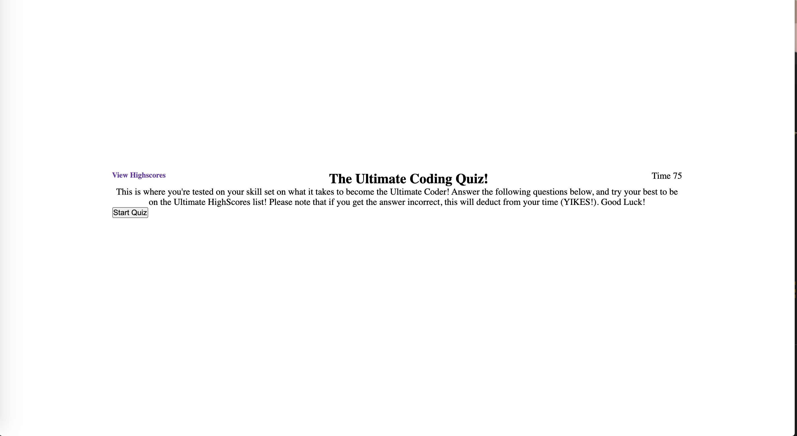

# code-quiz

This project is focused on creating a deployed timed quiz based off of JavaScript fundamentals that will ultimately store high scores to gauge progress in comparison to other peers in the Coding Boot Camp. In order to make this happen, I used the fundamentals of HTML and CSS to create a quiz structured with the following: a start button that transitions to a deployed quiz with questions and answers, answered questions will move into a new questions, if questions is answered incorrectly then the timer is deducted from. Once all questions are answered, you are deployed to a final score/high score page that shows your score in comparison to any high scores listed. 

Below are the images of my deployed timed quiz:

Here is the URL to access the Coding Quiz directly:
<a href="https://gracetalks.github.io/code-quiz/">Visit The Ultimate Coding Quiz!</a>